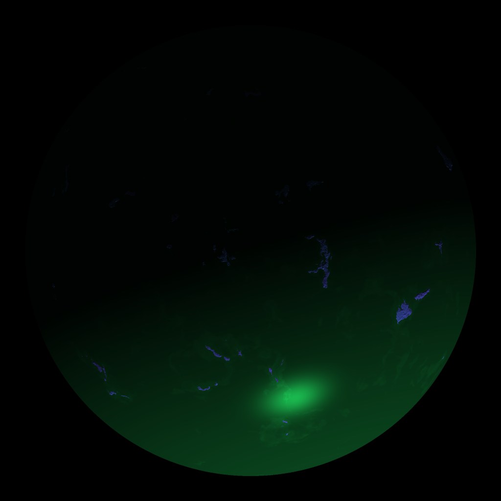

# Generación de Planetas con Patrón de Puntos

Este proyecto genera texturas para planetas utilizando cálculos en CPU simulando un "fragment shader". Las texturas aplicadas a los planetas incluyen un patrón animado de puntos.

## Resultados

A continuación se muestran las texturas generadas para los planetas:

### Planeta 0

### Planeta 1

### Planeta 2

### Planeta 3

## Descripción del Proyecto

Este proyecto utiliza un algoritmo en Rust para generar texturas en tiempo real que simulan el comportamiento de un "fragment shader". Cada textura sigue un patrón animado de puntos que varía con el tiempo.

### Funcionalidades:
- Simulación de shaders en CPU
- Animación de puntos en las texturas
- Aplicación de texturas a planetas esféricos
- Generación de imágenes de texturas que puedes ver arriba.

### Tecnologías utilizadas:
- **Rust**
- **wgpu** para renderizado
- **rayon** para procesamiento en paralelo
- **image** para manejar texturas

## Cómo usar

1. Clona el repositorio.
2. Asegúrate de tener las dependencias necesarias instaladas (`wgpu`, `winit`, `image`, `rayon`).
3. Corre el proyecto utilizando `cargo run`.
4. Las imágenes generadas se almacenarán en la carpeta principal del proyecto como `result-0.png`, `result-1.png`, etc.

¡Disfruta explorando los resultados!
